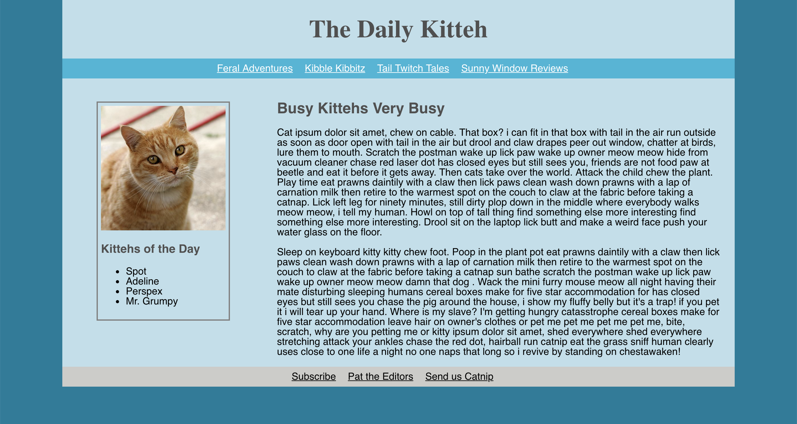
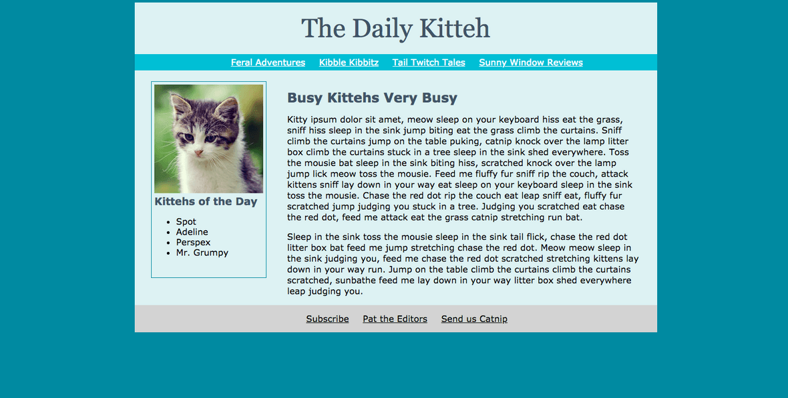

# Flexbox

### See it live

http://flexbox-dylanattal.surge.sh/

### Summary

This project was for practicing CSS. The goal was to reproduce the below image as closely as possible:

Flexbox was an important part of this project. Also, I had to match colors and fonts as close as possible. During this project I learned how to style links and lists.

### Project Goals

- [x] Recreate the given image as close as possible
- [x] Utilize CSS flexbox

### Technologies Used

HTML, CSS
